# networkanalyzer

## Binome

    Amayas SADI  28717408
    Hamid KOLLI  28717594
    Video  youtube : #TODO
    Github : https://github.com/Amayas29/networkanalyzer
    Language : java
    interface graphique : javafx (MVC) ou terminal

Une application d'analyse de trames ethernet

# Description du projet

L'application Networkanalyzer prend en parametre un fichier de trames et l'analyse tout en decodant les trames.

> les protocoles supportés par notre application :

Ethernet, IP, ARP, ICMP, UDP, DNS, DHCP

> les options et types decodés :

IP Options : 0, 1, 7, 131, 137

DNS types : A, AAAA, CNAME, NS, MX

DHCP Options : 0, 1, 3, 6, 12, 28, 43, 50, 51, 53, 54, 55, 57, 58, 59, 60 ,61,255

DHCP messages types : les 10  premiers

# Algorithme d'analyse

l'analyse se deroule en 2 phases

## Premiere phase

Une phase ou l'application crée un autre fichier contenant l'ensemble des trames (qui commencent par l'offset 0 dans le fichier fourni) avec une liste de pattern qui permet de detecter les lignes contenant des erreurs, le patern est sous format [nombre de ligne, l'indice du premier caractere de la ligne]

Cette premiere phase permet d'echappé les valeurs textuelles, les sauts de ligne et verifier l'offset s'il est valide

l'algorithme en code :

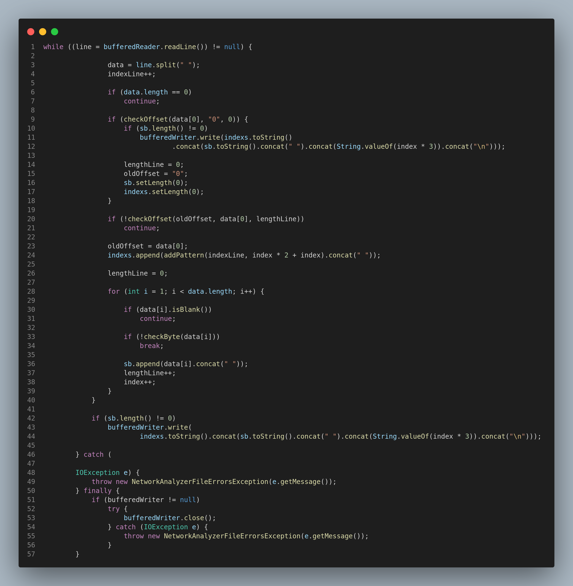

## Champs statiques des protocoles

Pour les champs statiques, on les a analysé directement en extrant le nombre d'octets exacts et le decoder en utilisant les methodes statiques de la classe __NetworkanalyzerTools__ et en testant leurs valeurs (par exemple l'adresse mac source ne doit pas etre un broadcast)

un exemple d'analyse des champs statiques

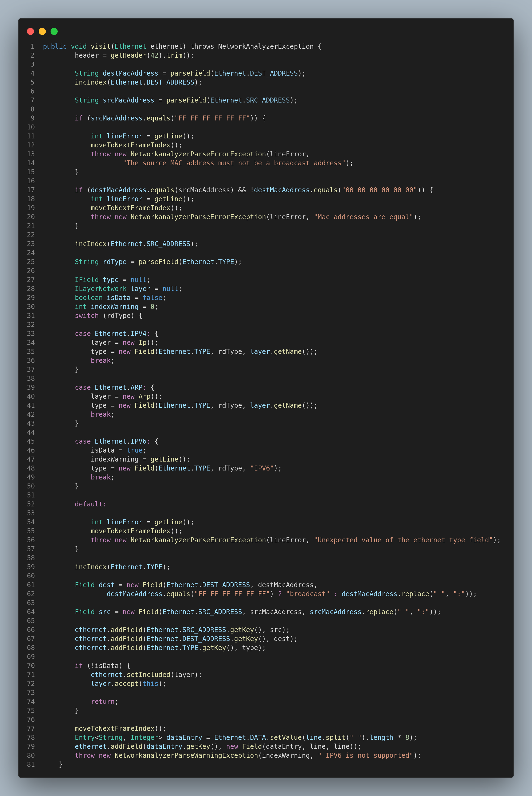

un exemple d'analyse des flags
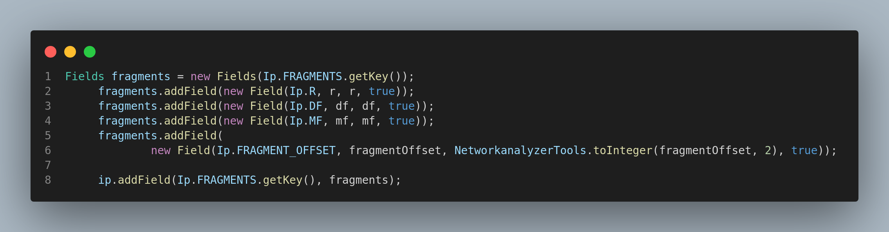

## Champs dynamiques des protocoles

pour les champs dynamiques on trouve 2 cas, soit pour les options de DHCP et IP, ou pour la decompression de DNS

pour les options, on utilise les methodes statiques de OptionBuilder qui sont __buildIpOptions(String)__ et __buildDhcpOptions(String)__ ou on parcoure la liste des octets qui sont passés en parametre des methodes et on teste le champs type d'option, si c'est une option que notre analyser supporte on la decode selon sa taille sinon on ajoute dans les octets en brut

un exemple d'analyse d'option

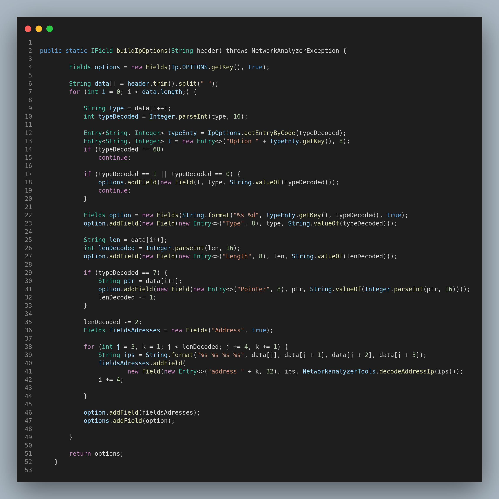

Pour les champs variables de DNS (exemple __Questions__), on a bouclé le nombre lu dans le champs statique correspondant (exemple __Questions Number__) pour recuperer tout les champs variables

la fonction utilisé

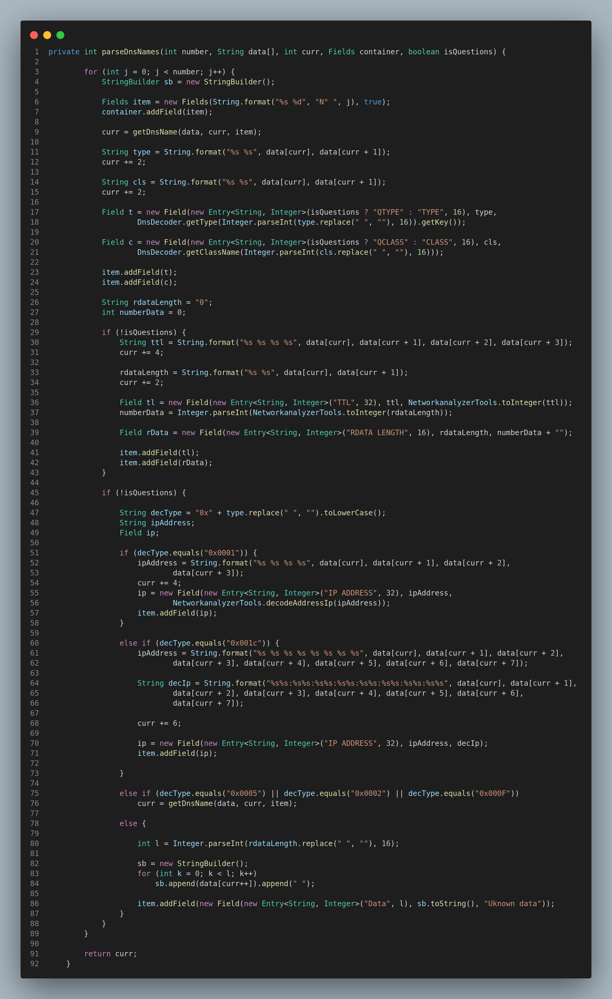

et pour decompresser les noms dans DNS, on a bouclé jusqu'a ce qu'on trouve l'octet **00** qui definit la fin du nom, et en testant si on doit sauter vers un label (si le champs qui remplace la taille commence par les bits **11** et les 14 autre bits correspondent au label)

pour tester si le premier octet du champs nom est un label, on a utilisé cette methode

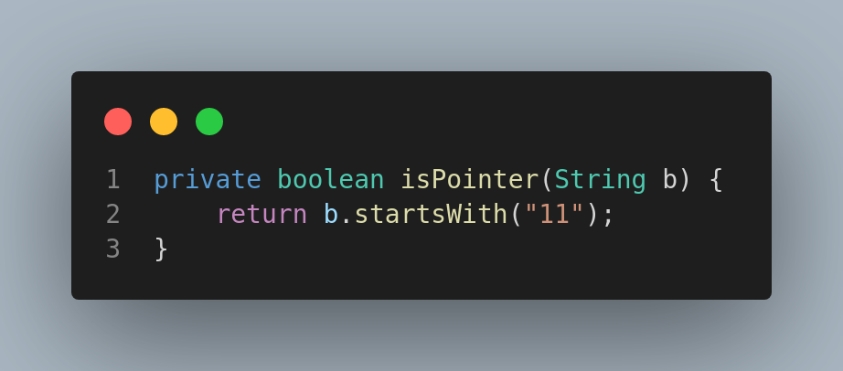

et la fonction qui decompresse le name:

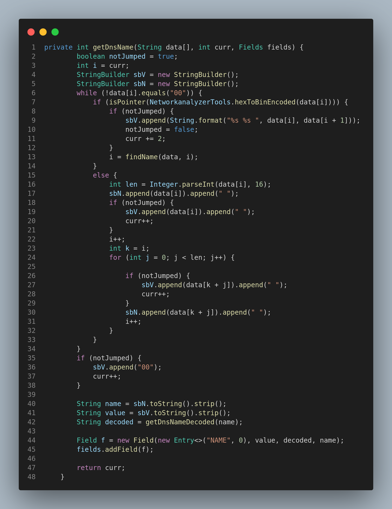

## Recuperation dynamique des noms des options et des types

Au lieu d'utiliser des __if else__ a chaque fois pour decoder le code des options , on a utilisé des __enum__ et la methode __getValue__ pour recuperer dynamiquement les noms des options par exmeple (le code 7 dans les options de IP correspant à **RECORD ROOT**)

Exemple : DhcpOption
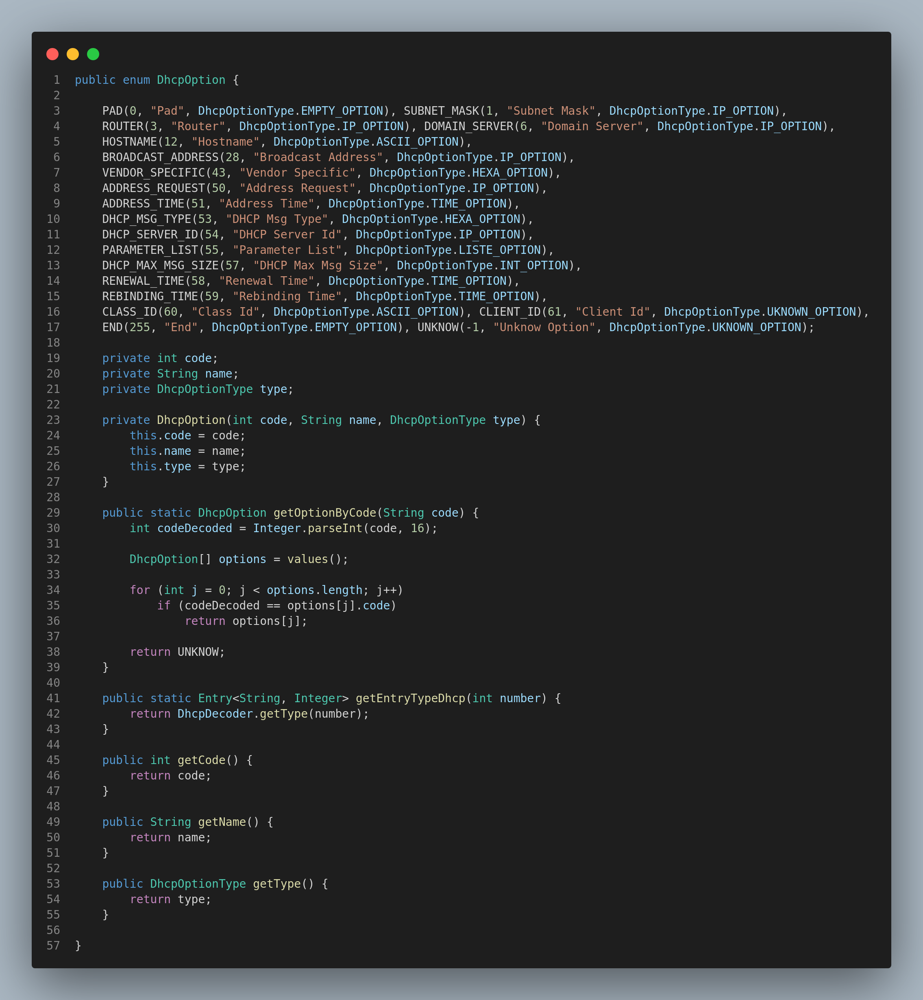

On a utilisé le meme mecanisme pour les differents types, sauf qu'on a utilisé une table de hachage au lieu d'une enum (moins couteuse (O(1))), donc on a utilisé des classes __Decoder__

Exemple : DhcpDecoder

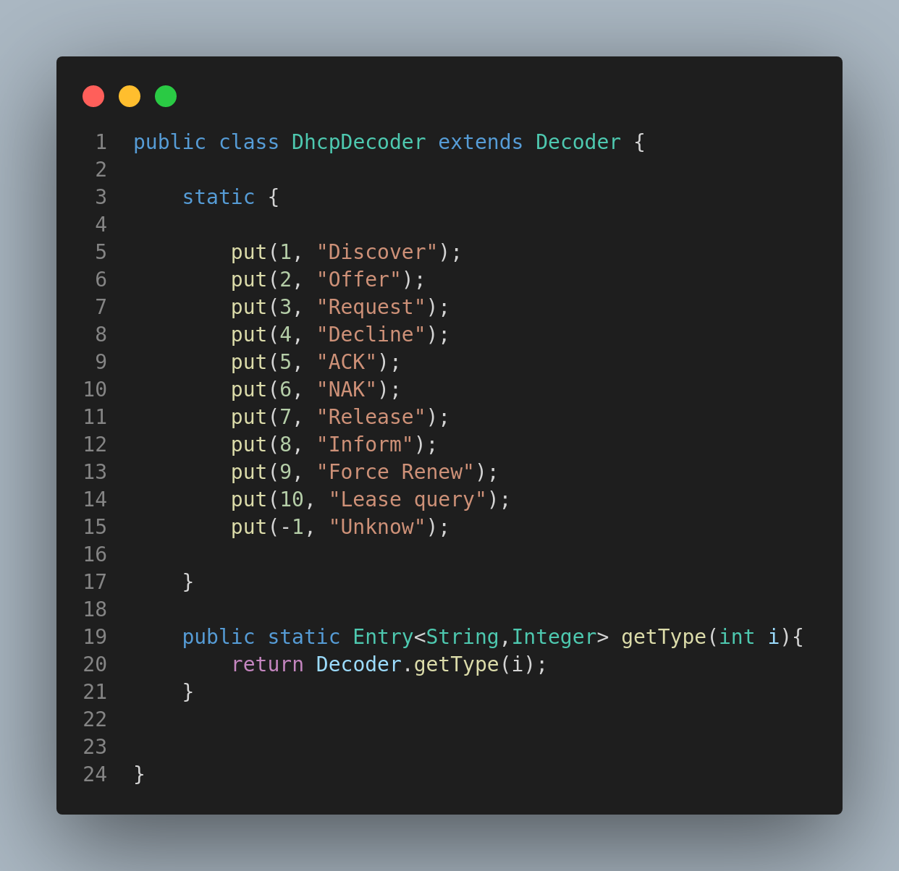

# Structure du projet

## Le Diagramme UML

- Les couches sont representés par des interface implementant l'interface __Layer__, et chaque protocole est representé par une classe qui implemente sa couche (par exemple la classe __Ethernet__ implemente __ILayerDataLink__) et qui herite __AbstractLayer__ qui est une classe qui factorise une table de hachage et ses methodes, la table de hachage contient les champs du protocole avec comme clé le nom du champs. Les protocoles qui ont un autre protocole a encapsulé, contiennent un attribut **include** (Exemple : __Ip__ contient un included de type __ILayerTransport__).

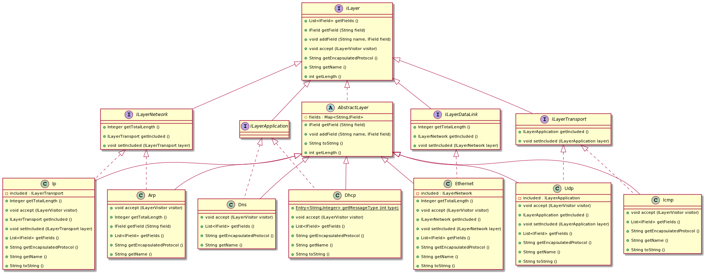

- Les champs sont representé par l'interface __IField__, les champs sont soit des champs simples donc des __Field__ ou des conteneurs d'autre champs comme les flags ou les options donc des __Fields__

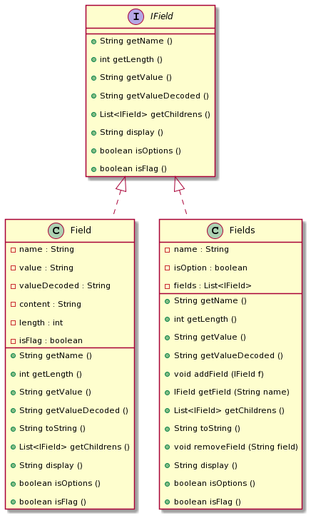

- Une trame est representé par la classe __Frame__, elle contient un seul attribut qui est de type __ILayerDataLink__, dans notre application on peut avoir que ethernet, et cette attribut encapsule toutes les autres couches
- Notre projet utilise une classe principale qui est __Analyzer__ qui contient toutes les trames (list de __Frame__) et toutes les erreurs et les warnings de notre application.
- La methode __Analyzer parse(File)__ de la classe __AnalyzerParser__ permet de faire les deux phase de l'analyse, d'abord elle fait appel a la methode statique __File reorganizeFile(File)__  de la classe __ParsingTools__ qui est une classe qui contient que des methodes statiques que l'application utilise pour faire la premiere phase du parse. Ensuite __AnalyzerParser__ lance la deuxieme phase du parse sur le nouveau fichier generé par __File reorganizeFile(File)__ en applant la methode __void accept(ILayerVisitor)__ (**DESIGN PATERN Visitor**)de l'objet du type __Ethernet__.

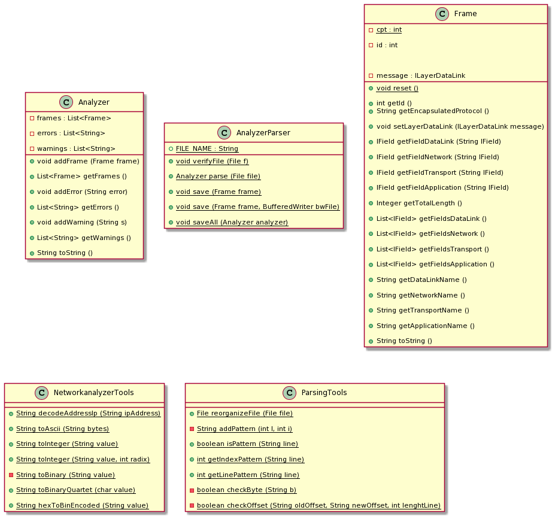

- L'application utilise le design pattern visitor pour faire la deuxieme phase de l'analyse, elle utilise une interface __ILayerVisitor__ qui a des methodes __void visit(-)__ avec des arguments des types des protocole, et la classe __LayerVisitor__ implement cette interface et permet d'analyser dans chaque methode __visit__ le protocole passée en parametre (Exemple __void visit(Ip)__ permet d'analyser l'entête IP et lancer l'analyse du transport en utilisant la methode __accept(ILayerVisitor)__ (qui est une methode definie dans chaque protocole et dans __ILayer__))

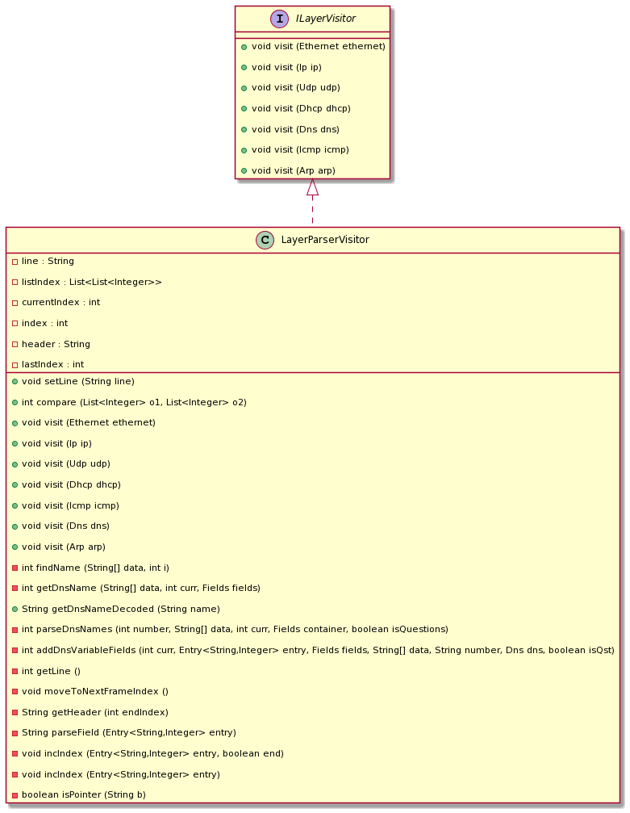

- Notre application utilise sa propre exception __NetworkanalyzerException__, et toutes les autres exceptions utilisés heritent de cette exception ou si on throw une autre exception propre a java on la capte et apres on throw une des __NetworkanalyzerException__

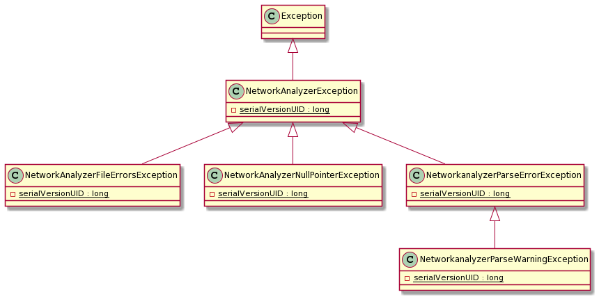
